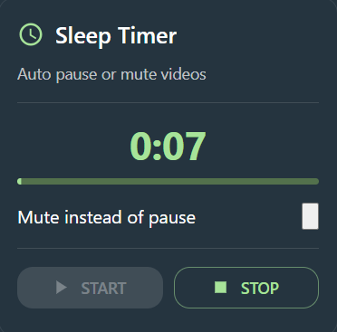

# 💤 Sleep Timer – Chrome Extension


A modern **Sleep Timer Chrome Extension** built with **React + Vite + Material UI + Radix UI**.  
Automatically **pause or mute videos** after a set time - perfect for late-night YouTube, courses, or binge watching.

---

## ✨ Features

- ⏱ **Set Sleep Timer** (slider, presets, or custom minutes)
- 🌙 **Dark Mode UI** (Material Design)
- 🟢 Primary accent color: `#A7E399`
- 🔁 **Persistent Countdown**
  - Timer keeps running even if popup is closed
  - Countdown resumes when popup is reopened
- 🔇 **Mute or Pause toggle** (Radix Switch)
- 📊 Live countdown with progress bar
- ⚡ Built with **Manifest v3**
- ♿ Accessible controls (Radix UI)

---

## 🖼 Preview




---

## 🧱 Tech Stack

- **React 19.2**
- **Vite**
- **Material UI (MUI)** – theming & layout
- **Radix UI** – accessible Slider & Switch
- **Chrome Extension API (MV3)**
- **chrome.storage.local** – persistent state

---

## 📁 Project Structure

```txt
sleep-timer-extension/
│
├── manifest.json
├── background/
│   └── serviceWorker.js
├── content/
│   └── contentScript.js
├── popup/
│   ├── index.html
│   ├── main.jsx
│   ├── App.jsx
│   └── components/
│       ├── TimerSlider.jsx   (Radix Slider)
│       ├── MuteSwitch.jsx   (Radix Switch)
│       └── Presets.jsx              
├── src/
│   └── screenshots/
│       ├── preview.png
├── vite.config.js
└── package.json
```

---

## 🛠️ Local Development

### Clone the repository
```bash
git clone <https://github.com/devajaypndey/sleep-timer-extension.git>
cd sleep-timer-extension
npm install
npm run dev
```

### Build for Chrome Extension
```bash
npm run build
```

### Install Extension in Chrome (Without Chrome Web Store)
1. Open Google Chrome and go to: **chrome://extensions**

2. Enable **Developer Mode**

3. Click **Load unpacked**

4. Select the **dist/** folder